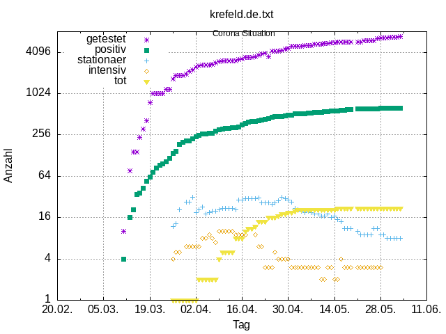

# Krefeld und Heinsberg Gnuplot (Beispiel Corona)

Etwas Code, um die Zahlen zweier Webseiten (per Hand gepflegt) in mit gnuplot darzustellen (Linux).

Beispiel [Kreis-Heinsberg.de PDF](https://github.com/no-go/coronaKrefeldGnuplot/blob/master/kreis-heinsberg.pdf)

## Beispiel mit Daten von Krefeld.de

